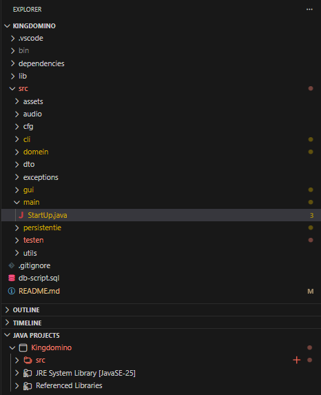
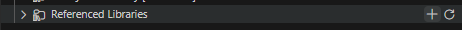
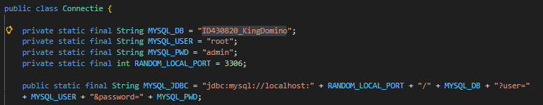
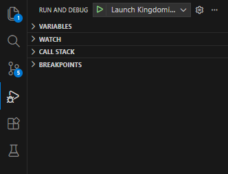
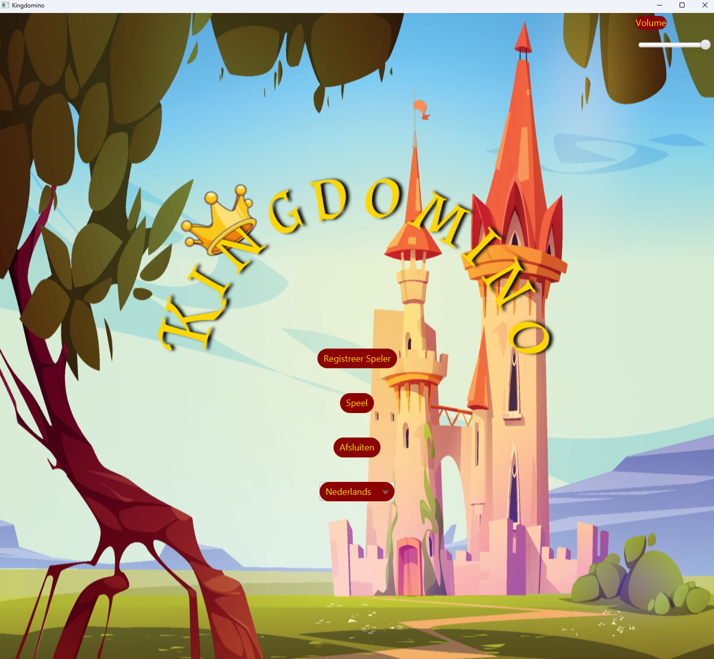

# Setup
This setup is only written for VS Code.

## Dependencies

- VS Code
    - Extensions
        - Extension Pack For java
- Java
    - Java JDK 21.0 or higher (Make sure JAVA_HOME is set in environment variables)
    - JavaFx SDK 21.0 included in repo or download from [GluonHQ](https://gluonhq.com/products/javafx/)
- MySql (Other methods like *docker* or different tools are also valid)
    - [Server](https://dev.mysql.com/downloads/mysql/)
    - [Workbench](https://dev.mysql.com/downloads/workbench/)

## 1. Referencing libraries

1. Open project folder (**Kingdomino**) in VS Code
2. Go to src/main and open StartUp.java to make sure VS Code recognizes the folder as a Java project, explorer should show the following

3. Click **+** on Referenced Libraries

4. Navigate to **dependencies/javafx-sdk-21.0.10/lib** and select all jars
5. Click **+** on Referenced Libraries again
6. Navigate to **dependencies** and select **jsch-0.1.55.jar** and **mysql-connector-j-8.3.0.jar**

## 2. Database Setup

Here you have 2 options:
1. Setup the database to the properties defined in the program
2. Edit variables in the program to fit the properties of a pre-existing database.

### Configuring Database to Program
1. When setting database properties make sure they follow:
    * port: 3306
    * user: root
    * password: admin
2. In MySQL Workbench or any other tool you may use open the script db-script.sql (**Kingdomino/db-script.sql**)
3. Execute the script and check if the schema is present
    * schema: ID430820_KingDomino

### Configuring Program to Database
1. Navigate to **src/persistentie/Connectie.java**
2. 5 variables will be defined at the top of the class

* MYSQL_DB = schema name
* MYSQL_USER = user
* MYSQL_PWD = password
* RANDOM_LOCAL_PORT = port
* MYSQL_JDBC = full connection string used to connect

3. change them to fit your needs
    * if the server is not running on localhost change **MYSQL_JDBC** and replace **localhost** with the adres of the server
4. In MySQL Workbench or any other tool you may use open the script db-script.sql (**Kingdomino/db-script.sql**)
5. Execute the script and check if the schema is present
    * schema: ID430820_KingDomino

## 3. Launching

1. Go to the Run and Debug tab (Ctrl + Shift + D) and select **Launch Kingdomino** in the dropdown

2. Finally hit the green button next to the dropdown
3. Kingdomino should show

